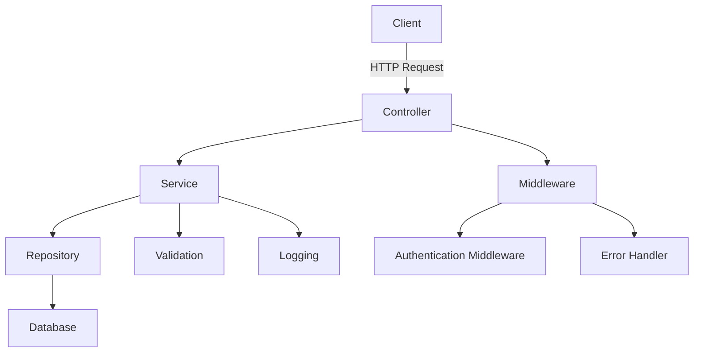
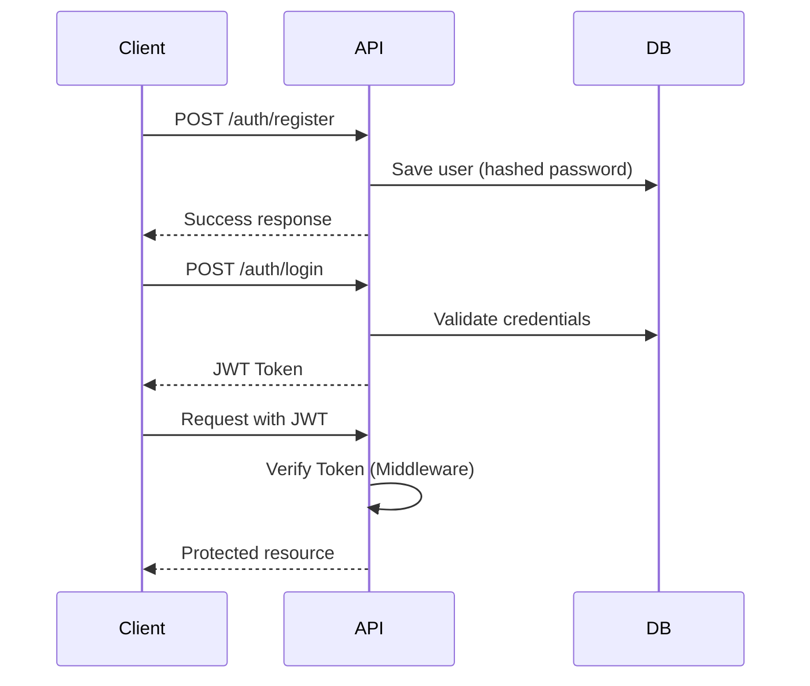

# Task API

A production-oriented REST API for task management built with Node.js, Express, and PostgreSQL.

This project focuses on clean architecture, authentication, testing, and real-world backend practices.

---

## Overview

Task API is designed to simulate a real backend system rather than a simple CRUD application.

It includes authentication, validation, testing, containerization, and CI integration.

---

## Tech Stack

- Node.js
- Express.js
- PostgreSQL
- pg (node-postgres)
- JSON Web Token (JWT)
- bcrypt
- Zod
- Morgan
- express-rate-limit
- Jest & Supertest
- Docker
- GitHub Actions

---

## Features

- JWT-based authentication (register & login)
- User-specific task management
- Create, read, update, and delete tasks
- Input validation using Zod
- Centralized error handling
- Rate limiting for API protection
- HTTP request logging
- Environment-based configuration
- Dockerized application
- Automated testing
- CI pipeline with GitHub Actions

---

## Architecture

The project follows a layered structure:

Controller → Service → Repository → Database



---

## Authentication Flow



---

## API Examples

### Register

Request:

```http
POST /auth/register
Content-Type: application/json
```

```json
{
  "email": "user@example.com",
  "password": "password123"
}
```

Response:

```json
{
  "message": "User created successfully"
}
```

---

### Login

Request:

```http
POST /auth/login
Content-Type: application/json
```

```json
{
  "email": "user@example.com",
  "password": "password123"
}
```

Response:

```json
{
  "token": "jwt_token_here"
}
```

---

### Create Task

Request:

```http
POST /tasks
Authorization: Bearer <token>
Content-Type: application/json
```

```json
{
  "title": "Complete backend project"
}
```

Response:

```json
{
  "id": "uuid",
  "title": "Complete backend project",
  "created_at": "timestamp"
}
```

---

### Get Tasks

Request:

```http
GET /tasks
Authorization: Bearer <token>
```

Response:

```json
[
  {
    "id": "uuid",
    "title": "Complete backend project",
    "created_at": "timestamp"
  }
]
```

---

## Live Demo

https://task-api-wo1v.onrender.com/

---

## Usage Notes

- All protected routes require a valid JWT token  
- Include the token in the Authorization header:

```
Authorization: Bearer <token>
```

- Rate limiting is enabled to prevent abuse  
- Requests and errors are logged for monitoring  

---

## Error Response Format

```json
{
  "error": "Error message",
  "status": 400
}
```

---

## CI Pipeline

The GitHub Actions pipeline includes:

- Installing dependencies  
- Setting up PostgreSQL test database  
- Running test suite  

---

## Future Improvements

- Redis caching for performance  
- Pagination and advanced filtering  
- Role-based authorization  
- API documentation with Swagger  

---

## License

This project is for educational and portfolio purposes.

---

## Author

Bedir Avşar  
Backend Developer
